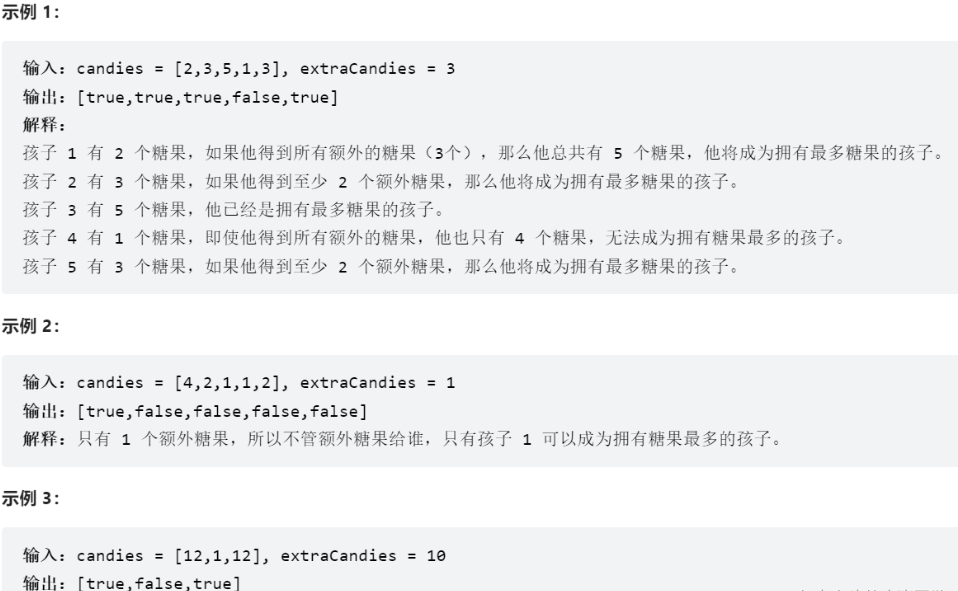
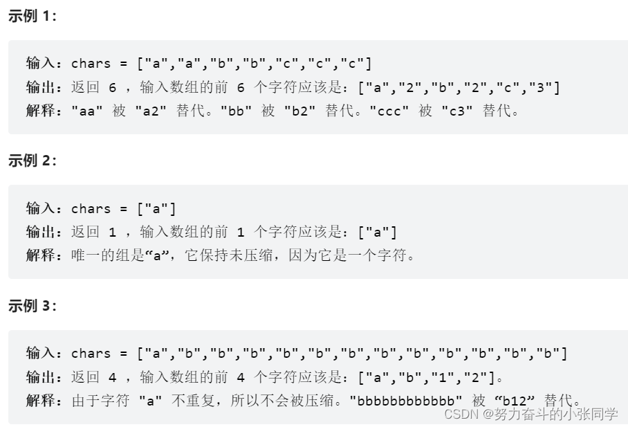

## 1768.交替合并字符串
两个字符串 word1 和 word2 。请你从 word1 开始，通过交替添加字母来合并字符串。如果一个字符串比另一个字符串长，就将多出来的字母追加到合并后字符串的末尾。
返回合并后的字符串 。

## 1071. 字符串中的最大公因子
对于字符串 s 和 t，只有在 s = t + ... + t（t 自身连接 1 次或多次）时，我们才认定 “t 能除尽 s”。
给定两个字符串 str1 和 str2 。返回 最长字符串 x，要求满足 x 能除尽 str1 且 x 能除尽 str2 。

## 1431. 拥有最多糖果的孩子

##  605. 种花问题
假设有一个很长的花坛，一部分地块种植了花，另一部分却没有。可是，花不能种植在相邻的地块上，它们会争夺水源，两者都会死去。

## 345. 反转字符串中的元音字母
给你一个字符串 s ，仅反转字符串中的所有元音字母，并返回结果字符串。
元音字母包括 'a'、'e'、'i'、'o'、'u'，且可能以大小写两种形式出现不止一次。

## 151. 反转字符串中的单词
给你一个字符串 s ，请你反转字符串中单词的顺序。
单词是由非空格字符组成的字符串。s 中使用至少一个空格将字符串中的 单词 分隔开。
返回 单词 顺序颠倒且 单词 之间用单个空格连接的结果字符串。
注意：输入字符串 s中可能会存在前导空格、尾随空格或者单词间的多个空格。返回的结果字符串中，单词间应当仅用单个空格分隔，且不包含任何额外的空格
- 示例1输入: " hello word   "  
- 示例1输出: "word hello"
- 示例2输入: "the sky is blue"  
- 示例2输出: "blue is sky the"

## 238. 除自身以外数组的乘积
给你一个整数数组 nums，返回 数组 answer ，其中 answer[i] 等于 nums 中除 nums[i] 之外其余各元素的乘积 。
题目数据 保证 数组 nums之中任意元素的全部前缀元素和后缀的乘积都在  32 位 整数范围内。
请不要使用除法，且在 O(n) 时间复杂度内完成此题。
- 示例1输入: nums=[1, 2, 3, 4]
- 示例1输出: [24, 12, 8, 6]
- 示例2输入: nums=[-1,1,0,-3,3]
- 示例2输出: [0,0,9,0,0]

## 334. 递增的三元子序列
给你一个整数数组 nums ，判断这个数组中是否存在长度为 3 的递增子序列。
如果存在这样的三元组下标 (i, j, k) 且满足 i < j < k ，使得 nums[i] < nums[j] < nums[k] ，返回 true; 否则, 返回 false。
- 示例1输入: nums=[1,2,3,4,5]
- 示例1输出: true
- 示例2输入: nums=[5,4,3,2,1]
- 示例2输出: false
- 示例3输入: nums=[2,1,5,0,4,6]
- 示例3输出: true

## 443. 压缩字符串
给你一个字符数组 chars ，请使用下述算法压缩: 
从一个空字符串 s 开始。对于 chars 中的每组 连续重复字符 ：
如果这一组长度为 1 ，则将字符追加到 s 中。
否则，需要向 s追加字符，后跟这一组的长度。
压缩后得到的字符串s不应该直接返回 ，需要转储到字符数组 chars 中。需要注意的是，如果组长度为 10 或 10 以上，则在 chars 数组中会被拆分为多个字符。
请在 修改完输入数组后 , 返回该数组的新长度。

## 矩阵旋转
有一个NxN整数矩阵，请编写一个算法，将矩阵"顺时针"旋转90度。
给定一个NxN的矩阵，和矩阵的阶数N,请返回旋转后的NxN矩阵。

- 解法1：先将矩阵转置后再将每行旋转；
- 