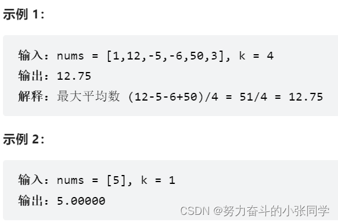
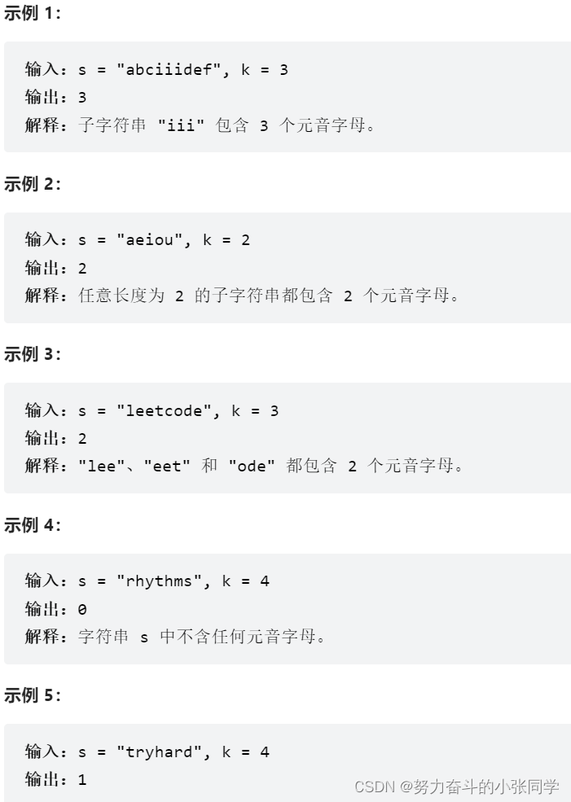
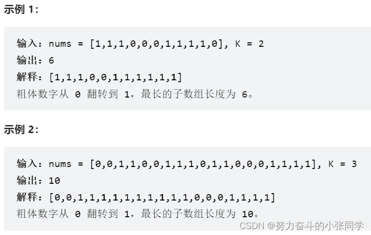
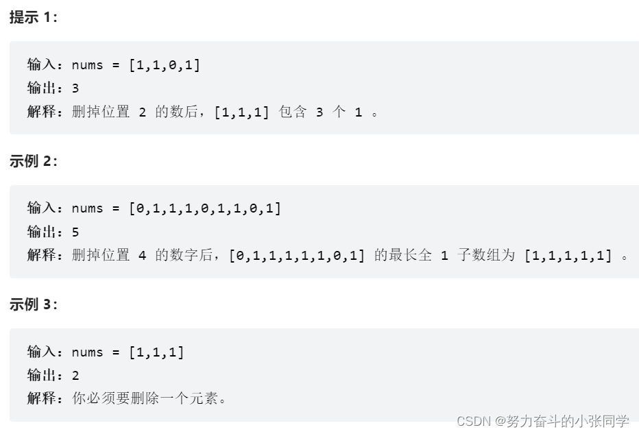

## 滑动窗口
### 643. 子数组最大平均数 I
给你一个由 n 个元素组成的整数数组 nums 和一个整数 k 。
请你找出平均数最大且 长度为 k 的连续子数组，并输出该最大平均数。
任何误差小于 10-5 的答案都将被视为正确答案。


### 1456. 定长子串中元音的最大数目
给你字符串 s 和整数 k 。
请返回字符串 s 中长度为 k 的单个子字符串中可能包含的最大元音字母数。
英文中的 元音字母 为(a, e, i, o, u)。


### 1004. 最大连续1的个数 III
给定一个二进制数组 nums 和一个整数 k，如果可以翻转最多 k 个 0 ，则返回 数组中连续 1 的最大个数 。


### 1493. 删掉一个元素以后全为 1 的最长子数组
给你一个二进制数组 nums ，你需要从中删掉一个元素。
请你在删掉元素的结果数组中，返回最长的且只包含 1 的非空子数组的长度。
如果不存在这样的子数组，请返回0 。


### 239.cc 滑动窗口最大值
- 给你一个整数数组 nums，有一个大小为 k 的滑动窗口从数组的最左侧移动到数组的最右侧。你只可以看到在滑动窗口内的 k 个数字。滑动窗口每次只向右移动一位。
- 返回 滑动窗口中的最大值 
##### 示例1
- 输入：nums = [1,3,-1,-3,5,3,6,7], k = 3
- 输出：[3,3,5,5,6,7]
- 解释：
```
滑动窗口的位置                最大值
---------------               -----
[1  3  -1] -3  5  3  6  7       3
 1 [3  -1  -3] 5  3  6  7       3
 1  3 [-1  -3  5] 3  6  7       5
 1  3  -1 [-3  5  3] 6  7       5
 1  3  -1  -3 [5  3  6] 7       6
 1  3  -1  -3  5 [3  6  7]      7
 ```

 - 思路：对于「最大值」，我们可以想到一种非常合适的数据结构，那就是优先队列（堆），其中的大根堆可以帮助我们实时维护一系列元素中的最大值。