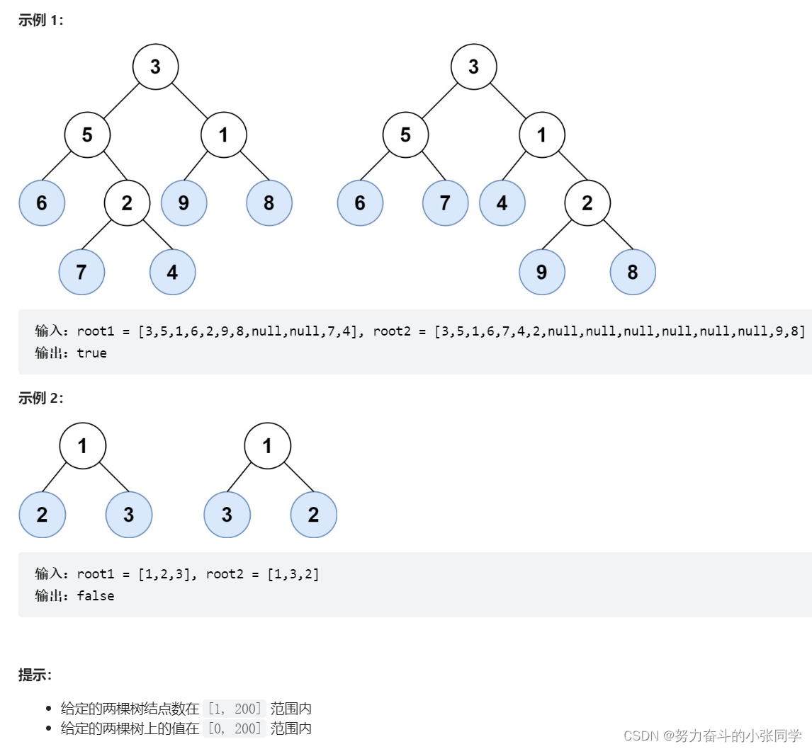
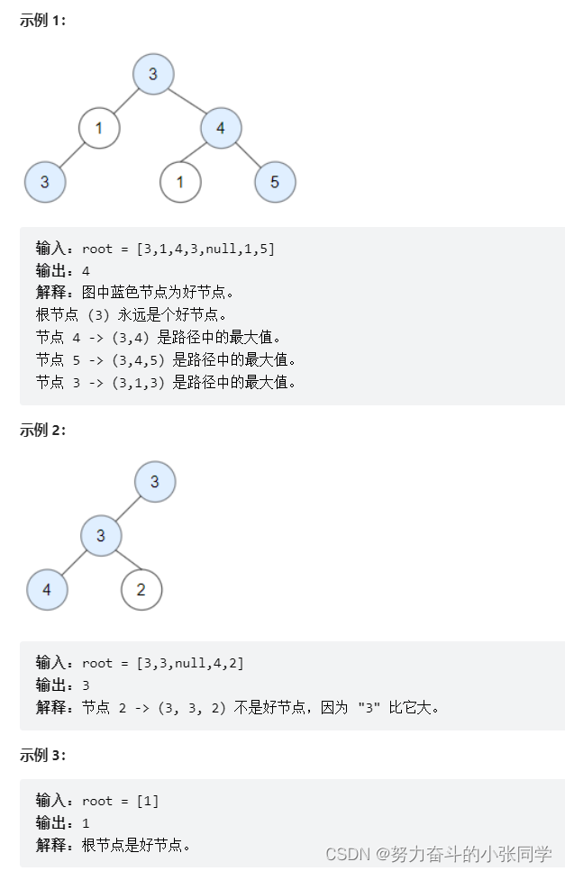
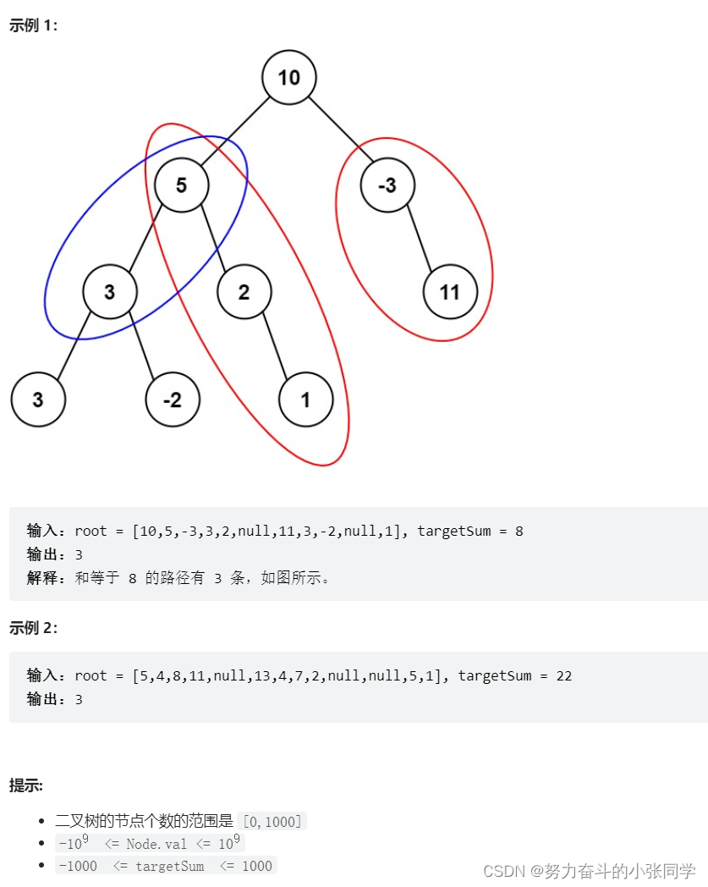
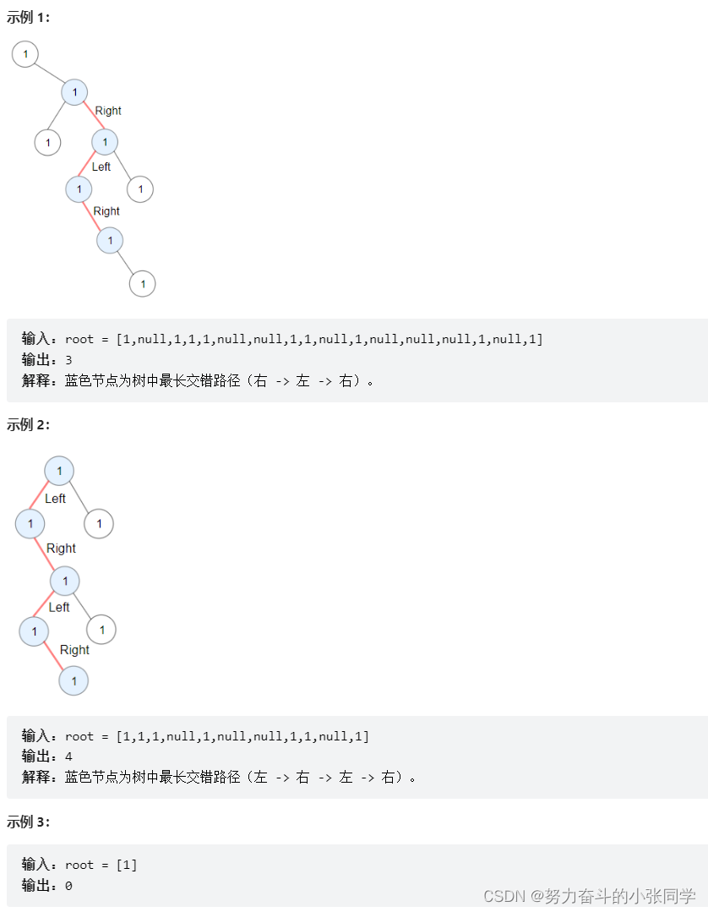

## 二叉树 - 深度优先搜索

### 104. 二叉树的最大深度

给定一个二叉树，找出其最大深度。
二叉树的深度为根节点到最远叶子节点的最长路径上的节点数。
说明: 叶子节点是指没有子节点的节点。

### 872. 叶子相似的树
请考虑一棵二叉树上所有的叶子，这些叶子的值按从左到右的顺序排列形成一个 叶值序列 。
举个例子，如上图所示，给定一棵叶值序列为 (6, 7, 4, 9, 8) 的树。
如果有两棵二叉树的叶值序列是相同，那么我们就认为它们是 叶相似 的。
如果给定的两个根结点分别为 root1 和 root2 的树是叶相似的，则返回 true；否则返回 false 。

### 1448. 统计二叉树中好节点的数目
给你一棵根为 root 的二叉树，请你返回二叉树中好节点的数目。
「好节点」X 定义为：从根到该节点 X 所经过的节点中，没有任何节点的值大于 X 的值。根节点永远是好节点

### 437. 路径总和 III
给定一个二叉树的根节点 root ，和一个整数 targetSum ，求该二叉树里节点值之和等于 targetSum 的 路径 的数目。

路径不需要从根节点开始，也不需要在叶子节点结束，但是路径方向必须是向下的(只能从父节点到子节点)。

### 1372. 二叉树中的最长交错路径

给你一棵以root为根的二叉树, 二叉树中的交错路径定义如下: 

选择二叉树中任意节点和一个方向(左或者右)。
如果前进方向为右, 那么移动到当前节点的的右子节点, 否则移动到它的左子节点。
改变前进方向: 左变右或者右变左。
重复第二步和第三步, 直到你在树中无法继续移动。
交错路径的长度定义为: 访问过的节点数目-1(单个节点的路径长度为0)。
请你返回给定树中最长交错路径的长度。

### 236. 二叉树的最近公共祖先
给定一个二叉树, 找到该树中两个指定节点的最近公共祖先。

百度百科中最近公共祖先的定义为："对于有根树 T 的两个节点 p、q，最近公共祖先表示为一个节点 x，满足 x 是 p、q 的祖先且 x 的深度尽可能大（一个节点也可以是它自己的祖先）。
