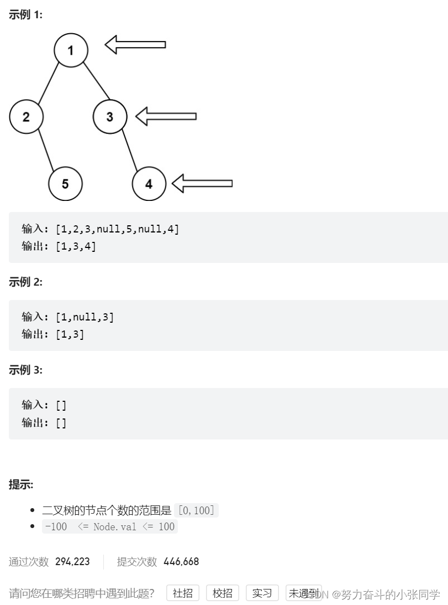

## 二叉树 - 广度优先搜索

### 199. 二叉树的右视图
给定一个二叉树的 根节点 root，想象自己站在它的右侧，按照从顶部到底部的顺序，返回从右侧所能看到的节点值。

### 1161. 最大层内元素和
1161. 最大层内元素和
给你一个二叉树的根节点 root。设根节点位于二叉树的第 1 层，而根节点的子节点位于第 2 层，依此类推。
请返回层内元素之和最大的那几层（可能只有一层）的层号，并返回其中最小的那个.
