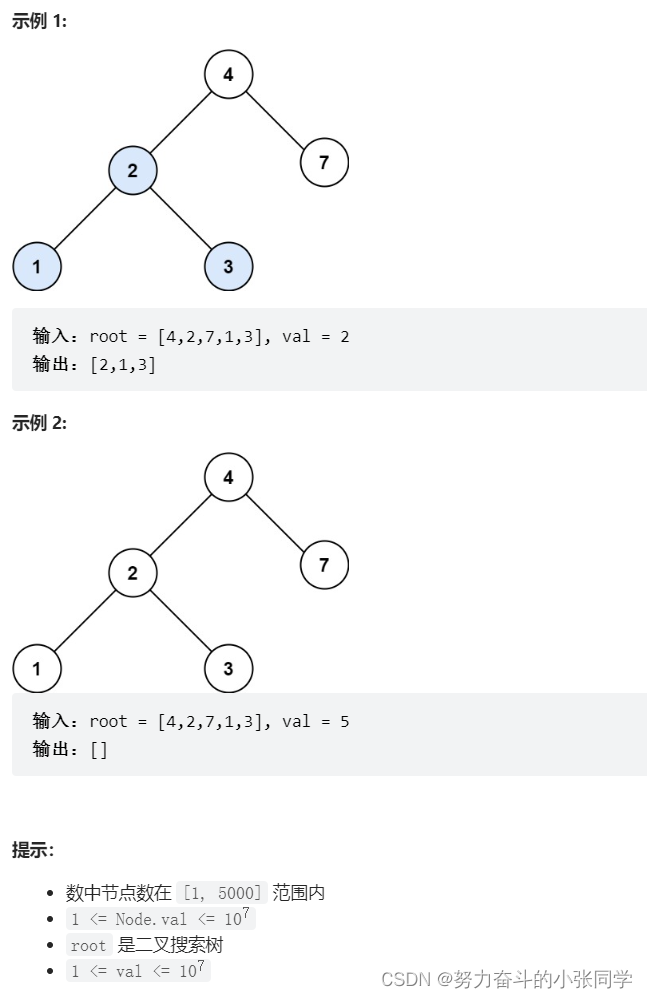

## 二叉搜索树
### 定义: 二叉搜索树是指一棵空树或者具有下列性质的二叉树：
- 若任意节点的左子树不空，则左子树上所有节点的值均小于它的根节点的值;
- 若任意节点的右子树不空，则右子树上所有节点的值均大于它的根节点的值;
- 任意节点的左、右子树也分别为二叉查找树;

### 700. 二叉搜索树中的搜索
给定二叉搜索树（BST）的根节点 root 和一个整数值 val。
你需要在 BST 中找到节点值等于val的节点。 返回以该节点为根的子树。 如果节点不存在，则返回 null 。

### 450. 删除二叉搜索树中的节点
给定一个二叉搜索树的根节点 root 和一个值 key, 删除二叉搜索树中的key对应的节点, 并保证二叉搜索树的性质不变。返回二叉搜索树(有可能被更新)的根节点的引用。
一般来说, 删除节点可分为两个步骤：
- 首先找到需要删除的节点; 
- 如果找到了, 删除它。
