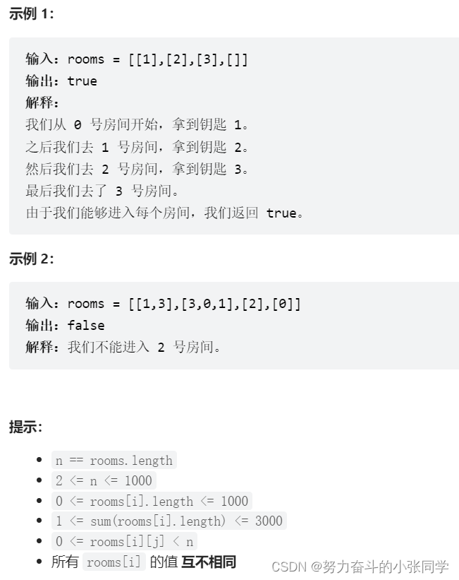
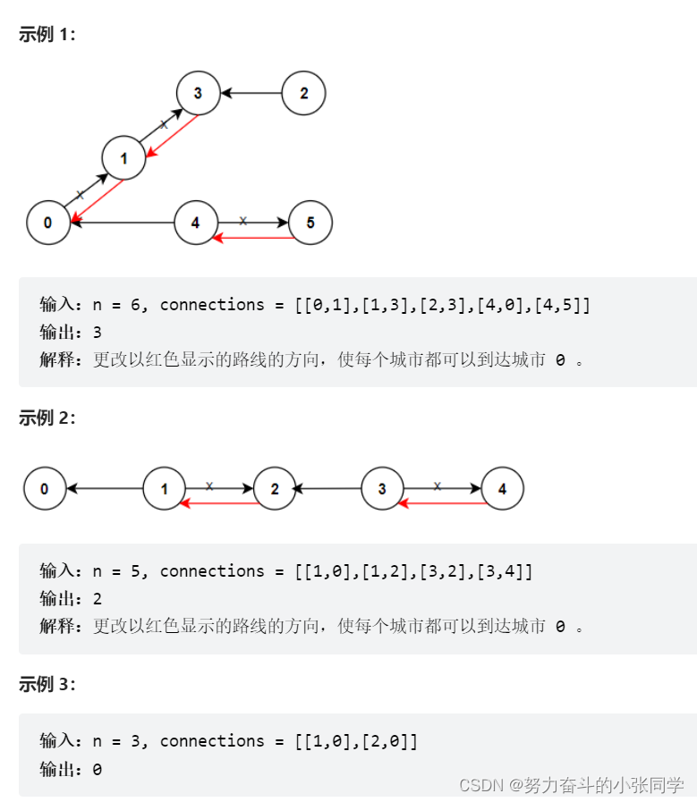

## 图-遍历方式
### xx.深度优先搜索算法(xx.cc)
深度优先搜索（DFS）是一种图遍历算法, 它从图的某一顶点开始,沿着一条边走到底,然后回溯,再沿着另一条边走到底, 依次类推。

### xxx.广度优先搜索算法(xxx.cc)
广度优先遍历（BFS）是一种图遍历算法，它从图的某个顶点开始，首先访问该顶点，然后逐层访问该顶点的邻接顶点。

## 图 - 深度优先搜索
### 841. 钥匙和房间
有n个房间，房间按从0到n-1编号。最初，除0号房间外的其余所有房间都被锁住。你的目标是进入所有的房间。然而，你不能在没有获得钥匙的时候进入锁住的房间。
当你进入一个房间，你可能会在里面找到一套不同的钥匙，每把钥匙上都有对应的房间号，即表示钥匙可以打开的房间。你可以拿上所有钥匙去解锁其他房间。
给你一个数组 rooms 其中 rooms[i] 是你进入 i 号房间可以获得的钥匙集合。如果能进入所有房间返回 true，否则返回 false。

### 547. 省份数量
有n个城市, 其中一些彼此相连, 另一些没有相连。如果城市 a 与城市 b 直接相连, 且城市 b 与城市 c 直接相连, 那么城市 a 与城市 c 间接相连。
省份 是一组直接或间接相连的城市，组内不含其他没有相连的城市。
给你一个 n x n 的矩阵 isConnected ，其中 isConnected[i][j] = 1 表示第 i 个城市和第 j 个城市直接相连，而 isConnected[i][j] = 0 表示二者不直接相连。

返回矩阵中省份的数量。

### 1466. 重新规划路线 
n座城市, 从0到n-1编号，其间共有n-1条路线。因此, 要想在两座不同城市之间旅行只有唯一一条路线可供选择(路线网形成一颗树)。去年,交通运输部决定重新规划路线,以改变交通拥堵的状况。

路线用 connections 表示，其中 connections[i] = [a, b] 表示从城市 a 到 b 的一条有向路线。
今年，城市 0 将会举办一场大型比赛，很多游客都想前往城市 0 。
请你帮助重新规划路线方向，使每个城市都可以访问城市 0 。返回需要变更方向的最小路线数。
题目数据 保证 每个城市在重新规划路线方向后都能到达城市 0 。

### 399. 除法求值
给你一个变量对数组 equations 和一个实数值数组 values 作为已知条件，其中 equations[i] = [Ai, Bi] 和 values[i] 共同表示等式 Ai / Bi = values[i] 。每个 Ai 或 Bi 是一个表示单个变量的字符串。

另有一些以数组 queries 表示的问题，其中 queries[j] = [Cj, Dj] 表示第 j 个问题，请你根据已知条件找出 Cj / Dj = ? 的结果作为答案。
返回 所有问题的答案 。如果存在某个无法确定的答案，则用 -1.0 替代这个答案。如果问题中出现了给定的已知条件中没有出现的字符串，也需要用 -1.0 替代这个答案。
注意：输入总是有效的。你可以假设除法运算中不会出现除数为 0 的情况，且不存在任何矛盾的结果

## 图 - 广度优先搜索
### 1926. 迷宫中离入口最近的出口

你一个 m x n 的迷宫矩阵 maze （下标从 0 开始），矩阵中有空格子（用 '.' 表示）和墙（用 '+' 表示）。同时给你迷宫的入口 entrance ，用 entrance = [entrancerow, entrancecol] 表示你一开始所在格子的行和列。
每一步操作，你可以往 上，下，左 或者 右 移动一个格子。你不能进入墙所在的格子，你也不能离开迷宫。你的目标是找到离 entrance 最近 的出口。出口 的含义是 maze 边界 上的 空格子。entrance 格子 不算 出口。
请你返回从 entrance 到最近出口的最短路径的 步数 ，如果不存在这样的路径，请你返回 -1

### 994. 腐烂的橘子
在给定的 m x n 网格 grid 中，每个单元格可以有以下三个值之一: 
值 0 代表空单元格;
值 1 代表新鲜橘子;
值 2 代表腐烂的橘子.
每分钟，腐烂的橘子 周围4个方向上相邻 的新鲜橘子都会腐烂.
返回 直到单元格中没有新鲜橘子为止所必须经过的最小分钟数。如果不可能，返回 -1.
