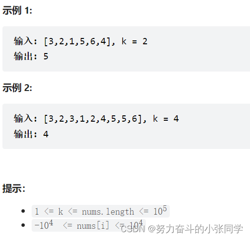

## 堆 / 优先队列

### xx.cc 构建最大堆
- (1)、构建最大堆(堆化): 首先，将待排序的数组视为一个二叉堆，通常选择最大堆作为排序的目标。
构建最大堆的过程涉及将数组中的元素逐个插入堆中并保持最大堆的性质。这通常是通过从最后一个非叶子节点(序号:n/2-1)开始，逐步向前遍历并对每个节点执行堆化（Heapify）操作来完成的。堆化操作的目标是确保父节点的值大于或等于其子节点的值。(通过交换)
- (2)、交换堆顶元素: 在最大堆中，堆顶元素是堆中的最大值。将堆顶元素与堆中的最后一个元素进行交换，这将把最大值移到数组的末尾。
- (3)、缩小堆的范围: 将堆的大小减一，即排除已排序的元素。这意味着堆的最后一个元素不再参与排序。
- (4)、重新调整堆: 为维持最大堆性质，需要对新的堆顶元素执行堆化操作。这通常包括将堆顶元素与其子节点比较并与较大的子节点交换，以确保堆的最大值再次位于堆顶。
- (5)、重复步骤2-4: 重复以上步骤，直到整个数组排序完成。这将导致逐渐将最大的元素移到已排序部分的末尾，并在每次迭代后缩小堆的范围。
- 在heapSort函数中，循环变量i的初始值被设置为 n/2 – 1。是为了保证从最后一个非叶子节点开始执行堆化操作。这是因为最后一个非叶子节点之后的节点都是叶子节点，它们没有子节点，所以不需要执行堆化操作。

### 215. 数组中的第K个最大元素

- 给定整数数组 nums 和整数 k，请返回数组中第 k 个最大的元素。
请注意，你需要找的是数组排序后的第 k 个最大的元素，而不是第 k 个不同的元素。
你必须设计并实现时间复杂度为 O(n) 的算法解决此问题

-解答: 使用最小堆

### 2336. 无限集中的最小数字

### 2542. 最大子序列的分数
### 2462. 雇佣 K 位工人的总代价