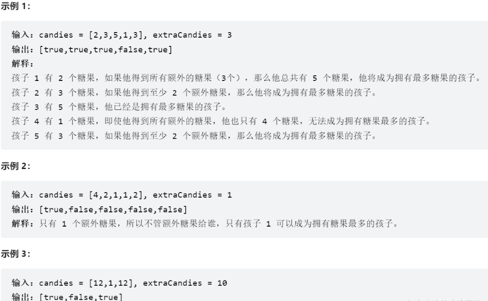

## 1768.交替合并字符串
两个字符串 word1 和 word2 。请你从 word1 开始，通过交替添加字母来合并字符串。如果一个字符串比另一个字符串长，就将多出来的字母追加到合并后字符串的末尾。
返回合并后的字符串 。

## 1071、字符串中的最大公因子
对于字符串 s 和 t，只有在 s = t + ... + t（t 自身连接 1 次或多次）时，我们才认定 “t 能除尽 s”。
给定两个字符串 str1 和 str2 。返回 最长字符串 x，要求满足 x 能除尽 str1 且 x 能除尽 str2 。

1431. 拥有最多糖果的孩子

