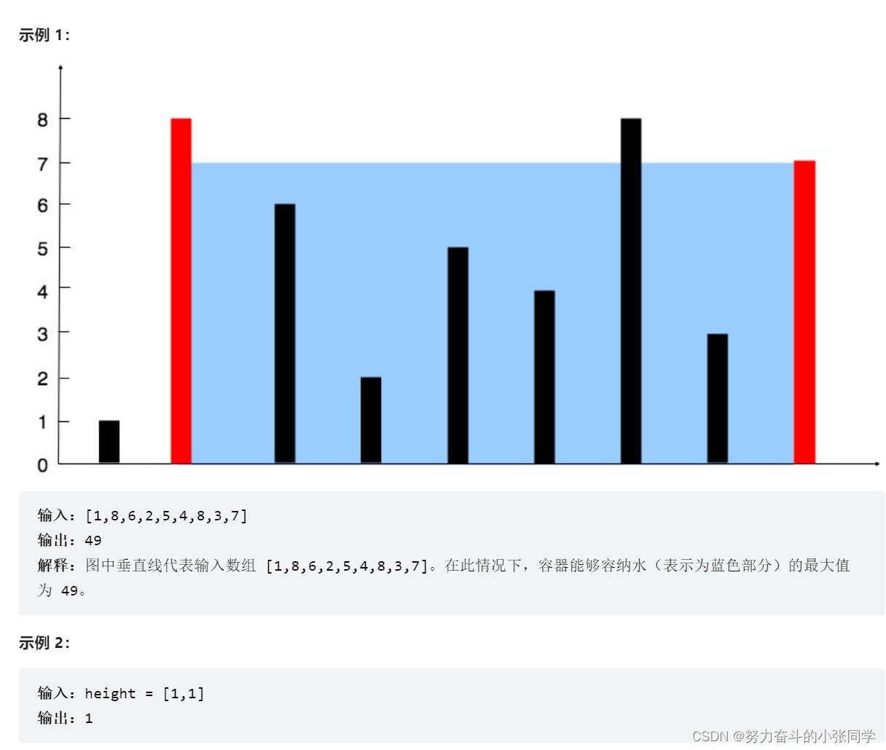

## 双指针
### 283. 移动零
给定一个数组 nums，编写一个函数将所有 0 移动到数组的末尾，同时保持非零元素的相对顺序。请注意 ，必须在不复制数组的情况下原地对数组进行操作。
### 392. 判断子序列
392. 判断子序列
给定字符串 s 和 t ，判断 s 是否为 t 的子序列。
字符串的一个子序列是原始字符串删除一些（也可以不删除）字符而不改变剩余字符相对位置形成的新字符串。（例如，"ace"是"abcde"的一个子序列，而"aec"不是）。
进阶: 
如果有大量输入的 S，称作 S1, S2, ... , Sk 其中 k >= 10亿，你需要依次检查它们是否为 T 的子序列。在这种情况下，你会怎样改变代码?
### 11. 盛最多水的容器
给定一个长度为 n 的整数数组 height 。有 n 条垂线，第 i 条线的两个端点是 (i, 0) 和 (i, height[i]) 。
找出其中的两条线，使得它们与 x 轴共同构成的容器可以容纳最多的水。
返回容器可以储存的最大水量。
说明：你不能倾斜容器。

### 1679. K 和数对的最大数目
给你一个整数数组 nums 和一个整数 k 。
每一步操作中，你需要从数组中选出和为 k 的两个整数，并将它们移出数组。
返回你可以对数组执行的最大操作数。
- 示例输入1: nums=[ 1,2,3,4],k=5
- 示例输出1: 2
- 示例解释1: 开始时, nums=[1,2,3,4]:移除1和4后, 之后是[2,3];再次移除2和3后, 之后是[];
不再有和为5的数对, 因此最后执行2次操作。