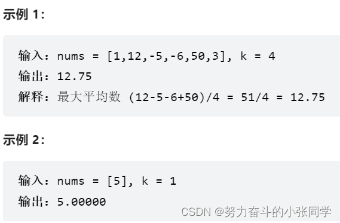
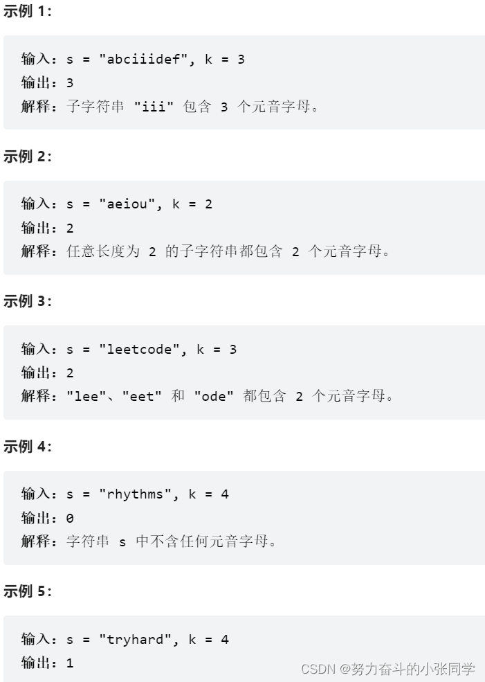
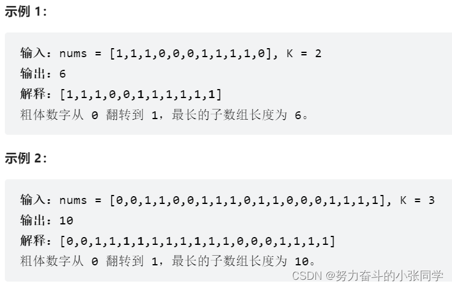
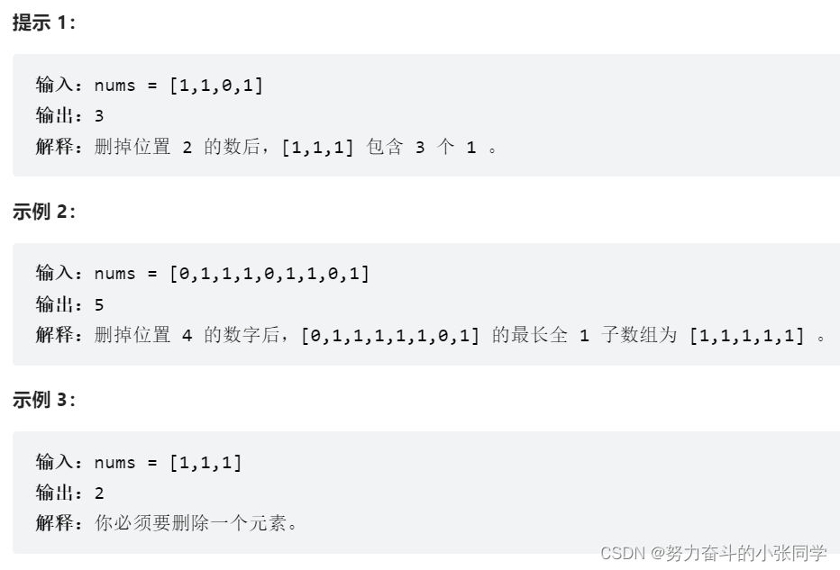

## 滑动窗口
### 643. 子数组最大平均数 I
给你一个由 n 个元素组成的整数数组 nums 和一个整数 k 。
请你找出平均数最大且 长度为 k 的连续子数组，并输出该最大平均数。
任何误差小于 10-5 的答案都将被视为正确答案。

### 1456. 定长子串中元音的最大数目
1456. 定长子串中元音的最大数目
给你字符串 s 和整数 k 。
请返回字符串 s 中长度为 k 的单个子字符串中可能包含的最大元音字母数。
英文中的 元音字母 为(a, e, i, o, u)。

### 1004. 最大连续1的个数 III
给定一个二进制数组 nums 和一个整数 k，如果可以翻转最多 k 个 0 ，则返回 数组中连续 1 的最大个数 。

### 1493. 删掉一个元素以后全为 1 的最长子数组
给你一个二进制数组 nums ，你需要从中删掉一个元素。
请你在删掉元素的结果数组中，返回最长的且只包含 1 的非空子数组的长度。
如果不存在这样的子数组，请返回0 。
