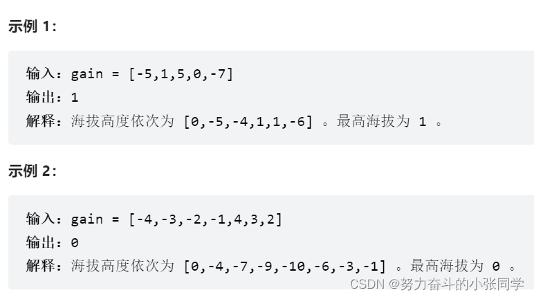

### 前缀和
#### 1732. 找到最高海拔
有一个自行车手打算进行一场公路骑行，这条路线总共由 n + 1 个不同海拔的点组成。自行车手从海拔为 0 的点 0 开始骑行。
给你一个长度为 n 的整数数组 gain ，其中 gain[i] 是点 i 和点 i + 1 的 净海拔高度差（0 <= i < n）。请你返回最高点的海拔 。

#### 724. 寻找数组的中心下标
给你一个整数数组 nums ，请计算数组的 中心下标 。
数组 中心下标 是数组的一个下标，其左侧所有元素相加的和等于右侧所有元素相加的和。
如果中心下标位于数组最左端，那么左侧数之和视为 0 ，因为在下标的左侧不存在元素。这一点对于中心下标位于数组最右端同样适用。
如果数组有多个中心下标，应该返回 最靠近左边 的那一个。如果数组不存在中心下标，返回 -1 。
