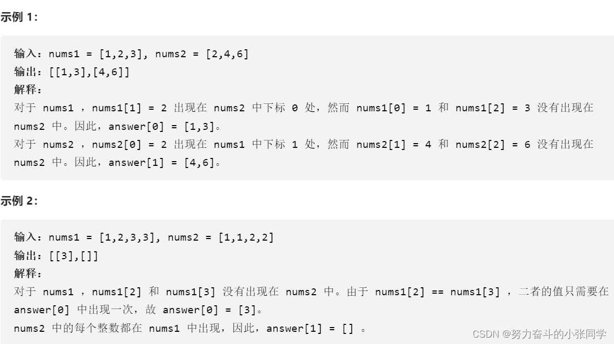
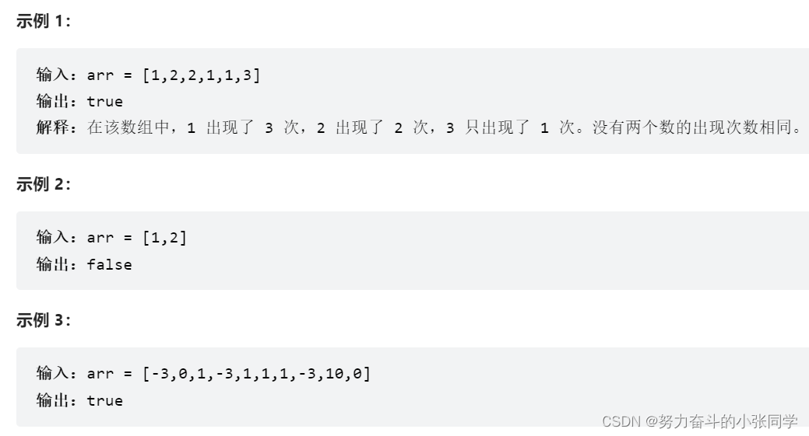
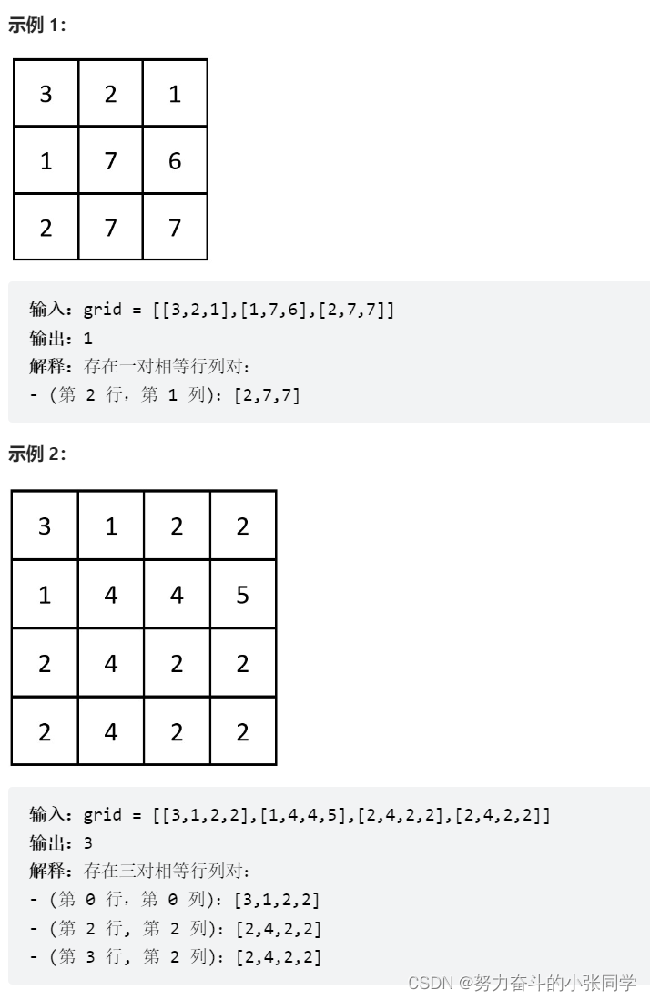

## 哈希表 / 哈希集合

### 2215. 找出两数组的不同
给你两个下标从 0 开始的整数数组 nums1 和 nums2 ，请你返回一个长度为 2 的列表 answer ，其中：
answer[0] 是 nums1 中所有 不 存在于 nums2 中的 不同 整数组成的列表。
answer[1] 是 nums2 中所有 不 存在于 nums1 中的 不同 整数组成的列表。
注意：列表中的整数可以按 任意 顺序返回。

### 1207. 独一无二的出现次数
给你一个整数数组 arr，请你帮忙统计数组中每个数的出现次数。
如果每个数的出现次数都是独一无二的，就返回 true；否则返回 false。

### 1657. 确定两个字符串是否接近
如果可以使用以下操作从一个字符串得到另一个字符串，则认为两个字符串接近 ：

操作 1：交换任意两个现有字符。
例如，abcde -> aecdb
操作 2：将一个现有字符的每次出现转换为另一个现有字符，并对另一个字符执行相同的操作。
例如，aacabb -> bbcbaa（所有 a 转化为 b ，而所有的 b 转换为 a ）
你可以根据需要对任意一个字符串多次使用这两种操作。
给你两个字符串，word1 和 word2 。如果 word1 和 word2 接近 ，就返回 true ；否则，返回 false 。

### 2352. 相等行列对
给你一个下标从 0 开始、大小为 n x n 的整数矩阵 grid ，返回满足 Ri 行和 Cj 列相等的行列对 (Ri, Cj) 的数目。
如果行和列以相同的顺序包含相同的元素（即相等的数组），则认为二者是相等的。

