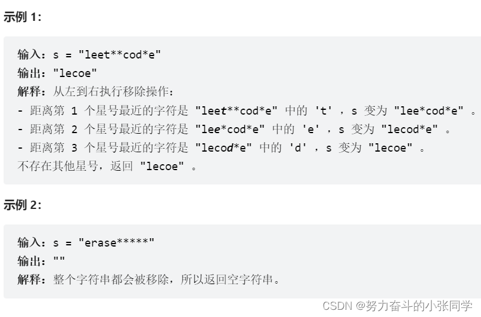
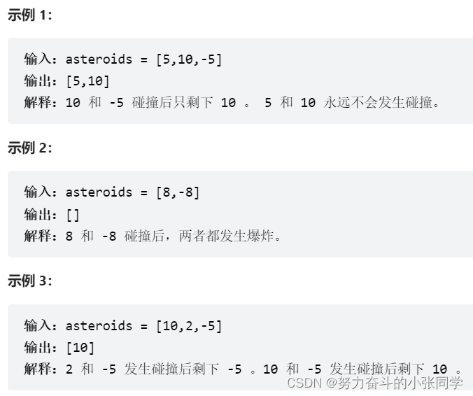
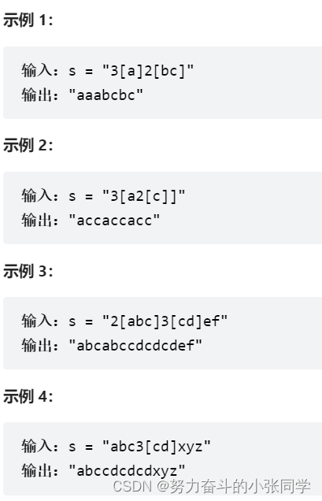

## 栈
### 2390. 从字符串中移除星号
给你一个包含若干星号 * 的字符串s。
在一步操作中，你可以：
选中s中的一个星号。
移除星号左侧最近的那个非星号字符，并移除该星号自身。
返回移除所有星号之后的字符串。
注意：
生成的输入保证总是可以执行题面中描述的操作。
可以证明结果字符串是唯一的。

### 735. 行星碰撞
给定一个整数数组 asteroids，表示在同一行的行星。
对于数组中的每一个元素，其绝对值表示行星的大小，正负表示行星的移动方向（正表示向右移动，负表示向左移动）。每一颗行星以相同的速度移动。
找出碰撞后剩下的所有行星。碰撞规则：两个行星相互碰撞，较小的行星会爆炸。如果两颗行星大小相同，则两颗行星都会爆炸。两颗移动方向相同的行星，永远不会发生碰撞。

### 394. 字符串解码

给定一个经过编码的字符串, 返回它解码后的字符串。
编码规则为: k[encoded_string], 表示其中方括号内部的encoded_string正好重复k次。注意k保证为正整数。
你可以认为输入字符串总是有效的; 输入字符串中没有额外的空格, 且输入的方括号总是符合格式要求的。
此外, 你可以认为原始数据不包含数字,所有的数字只表示重复的次数k, 例如不会出现像 3a或2[4]的输入。
