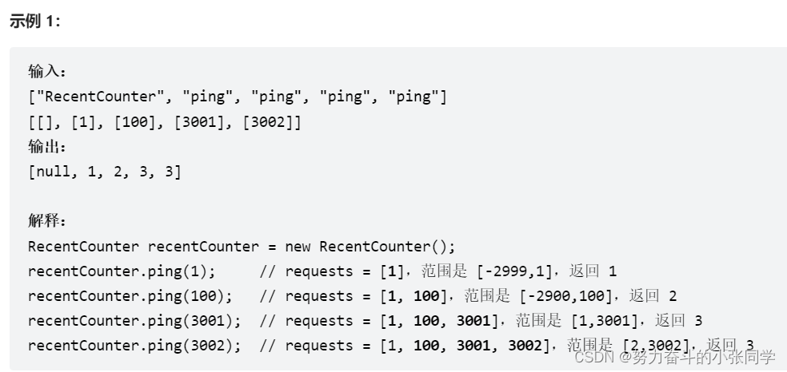
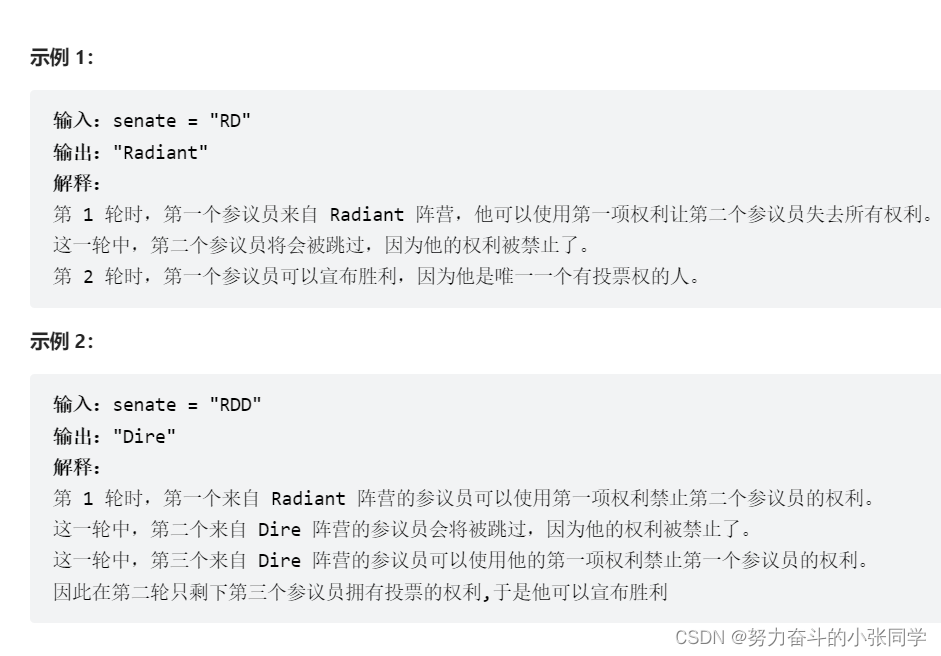

## 队列
### 933. 最近的请求次数
写一个 RecentCounter 类来计算特定时间范围内最近的请求。
请你实现 RecentCounter 类：
RecentCounter() 初始化计数器，请求数为 0 。
int ping(int t) 在时间 t 添加一个新请求，其中 t 表示以毫秒为单位的某个时间，并返回过去 3000 毫秒内发生的所有请求数(包括新请求)。确切地说，返回在 [t-3000, t] 内发生的请求数。
保证每次对ping的调用都使用比之前更大的t值。

### 649. Dota2 参议院
Dota2 的世界里有两个阵营：Radiant（天辉）和 Dire（夜魇）

Dota2 参议院由来自两派的参议员组成。现在参议院希望对一个 Dota2 游戏里的改变作出决定。他们以一个基于轮为过程的投票进行。在每一轮中，每一位参议员都可以行使两项权利中的 一 项：

禁止一名参议员的权利：参议员可以让另一位参议员在这一轮和随后的几轮中丧失 所有的权利 。
宣布胜利：如果参议员发现有权利投票的参议员都是 同一个阵营的 ，他可以宣布胜利并决定在游戏中的有关变化。
给你一个字符串 senate 代表每个参议员的阵营。字母 'R' 和 'D'分别代表了 Radiant（天辉）和 Dire（夜魇）。然后，如果有 n 个参议员，给定字符串的大小将是 n。

以轮为基础的过程从给定顺序的第一个参议员开始到最后一个参议员结束。这一过程将持续到投票结束。所有失去权利的参议员将在过程中被跳过。

假设每一位参议员都足够聪明，会为自己的政党做出最好的策略，你需要预测哪一方最终会宣布胜利并在 Dota2 游戏中决定改变。输出应该是 "Radiant" 或 "Dire" 。

