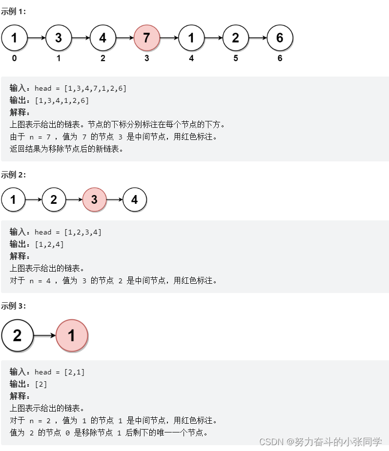
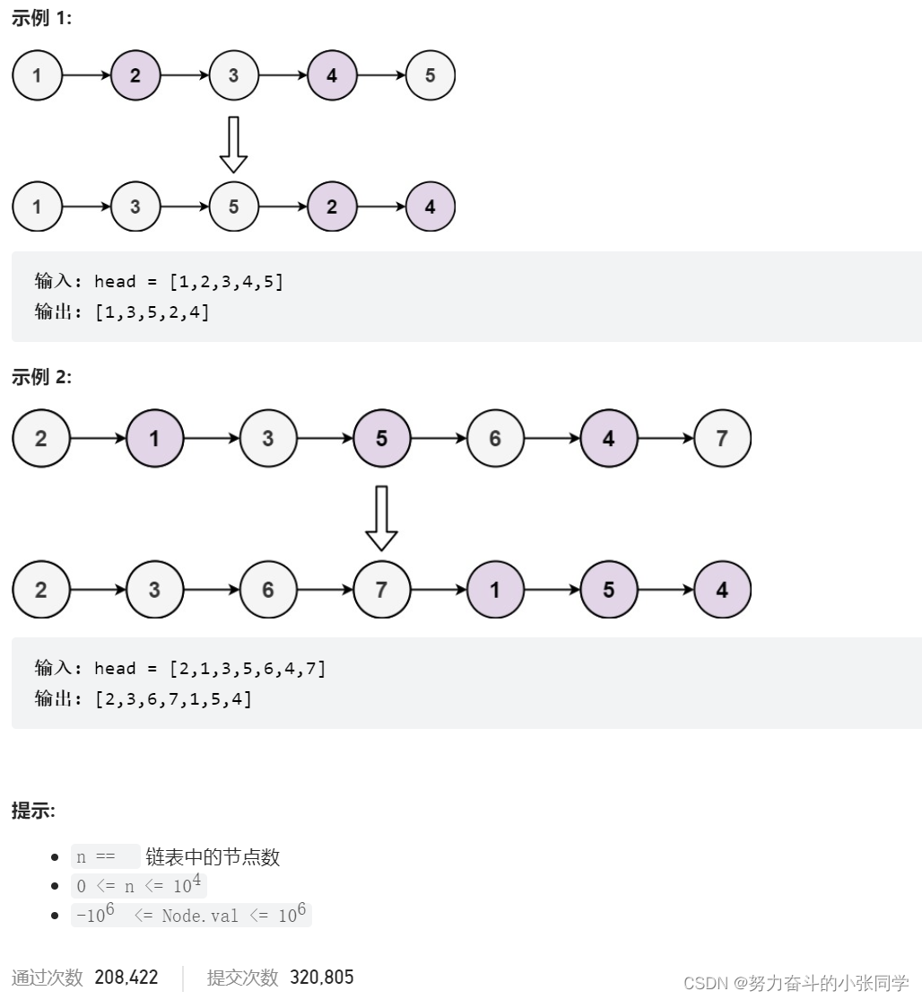
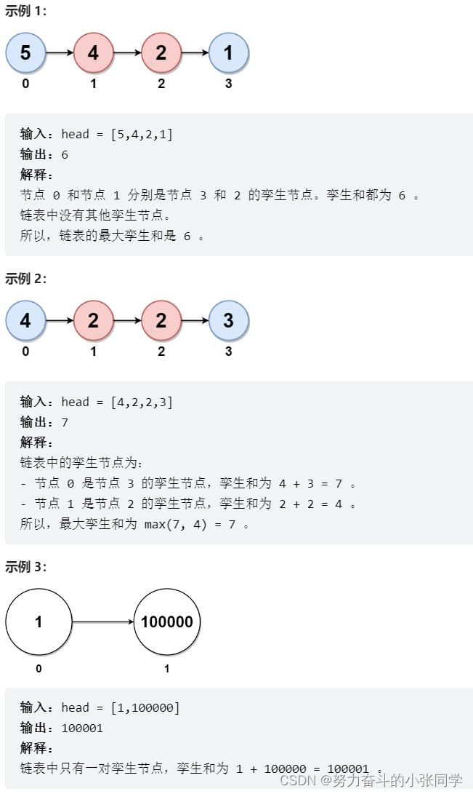

## 链表

### 206. 反转链表
### xxx. 反转m到n序号的链表

### 2095. 删除链表的中间节点
给你一个链表的头节点 head 。删除链表的中间节点 ，并返回修改后的链表的头节点 head。
长度为 n 链表的中间节点是从头数起第 ⌊n / 2⌋ 个节点（下标从 0 开始），其中 ⌊x⌋ 表示小于或等于 x 的最大整数。
对于 n = 1、2、3、4 和 5 的情况，中间节点的下标分别是 0、1、1、2 和 2. 

### 328. 奇偶链表
给定单链表的头节点 head ，将所有索引为奇数的节点和索引为偶数的节点分别组合在一起，然后返回重新排序的列表。
第一个节点的索引被认为是奇数, 第二个节点的索引为偶数 ，以此类推。
请注意，偶数组和奇数组内部的相对顺序应该与输入时保持一致。
你必须在 O(1) 的额外空间复杂度和 O(n) 的时间复杂度下解决这个问题。

### xx. 合并两个有序链表

### 2130. 链表最大孪生和

在一个大小为 n 且 n 为 偶数 的链表中，对于 0 <= i <= (n / 2) - 1 的 i ，第 i 个节点（下标从 0 开始）的孪生节点为第 (n-1-i) 个节点 。
比方说，n = 4 那么节点 0 是节点 3 的孪生节点，节点 1 是节点 2 的孪生节点。这是长度为 n = 4 的链表中所有的孪生节点。
孪生和定义为一个节点和它孪生节点两者值之和。
给你一个长度为偶数的链表的头节点 head, 请你返回链表的最大孪生和。

### x.汇总
